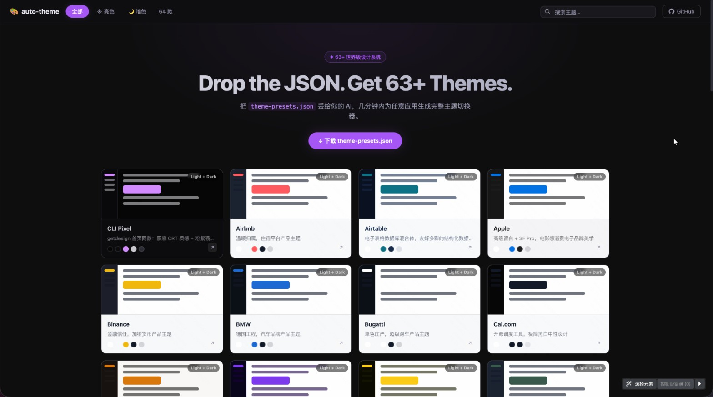
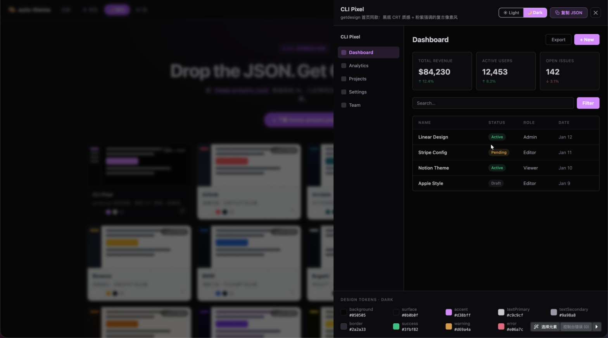

<div align="center">

# 🎨 auto-theme

**World-class design systems, reverse-engineered and ready to use.**
**世界级设计系统，逆向解析，开箱即用。**

[](https://opensource.org/licenses/MIT)
[](./theme-presets.json)
[](#-theme-gallery)
[](./CONTRIBUTING.md)

*Stop spending days on design systems. Start with the best ones in the world.*
*不再花几天时间研究设计系统，直接使用世界上最好的那些。*

[Browse Themes · 浏览主题](#-theme-gallery) · [Quick Start · 快速开始](#-quick-start) · [JSON Presets · JSON预设](#-use-the-json-presets) · [Contribute · 贡献](#-contributing)

**🌐 [Live Demo · 在线预览](https://devldq.github.io/auto-theme/) — Browse all 63+ themes interactively / 在线浏览全部 63+ 主题**

<br/>

<table>
  <tr>
    <td width="50%">
      <a href="https://devldq.github.io/auto-theme/">
        
      </a>
      <p align="center"><sub>主题浏览 · Theme Gallery</sub></p>
    </td>
    <td width="50%">
      <a href="https://devldq.github.io/auto-theme/">
        
      </a>
      <p align="center"><sub>主题详情预览 · Theme Detail Panel</sub></p>
    </td>
  </tr>
</table>

*👆 Click to open the live demo / 点击图片进入在线预览*

</div>

---

## 🚀 Quickest Way to Use / 最快上手方式

**Drop `theme-presets.json` into your AI chat — get a full theme switcher like this built into your app in minutes.**
**把 `theme-presets.json` 丢给 AI，几分钟内为你的应用生成如上图所示的完整主题切换器。**

1. **Download** [`theme-presets.json`](./theme-presets.json) from this repo / **下载**本仓库的 `theme-presets.json`
2. **Upload it to your AI** (ChatGPT, Claude, Cursor, etc.) along with your codebase / **上传给 AI**（ChatGPT、Claude、Cursor 等），同时附上你的项目代码
3. **Prompt:** *"Use the themes in this JSON to generate a theme switcher for my app. Let me pick from all 63+ styles."* / **提示词：** *"用这个 JSON 里的主题，为我的应用生成一个主题切换器，让我能从 63+ 种风格中自由选择。"*
4. **Done.** Your app now supports 63+ world-class themes / **完成。** 你的应用立刻拥有 63+ 款世界级设计主题

> 💡 The JSON contains complete light & dark mode configs for every theme — your AI has everything it needs to wire it up.
> 💡 JSON 中包含每个主题完整的亮/暗色配置，AI 拿到即可直接接入，无需额外调研。

---

## 🤔 What is this? / 这是什么？

**auto-theme** is a curated collection of **63+ design systems** from the world's most respected tech companies and brands — reverse-engineered and documented in a format that's immediately usable by developers and designers.
**auto-theme** 是一个精心整理的 **63+ 设计系统**合集，来源于全球最受尊重的科技公司和品牌——逆向解析后以开发者和设计师可以直接使用的格式记录。

Each theme includes:
每个主题包含：

- 🎨 **Complete color palettes** (backgrounds, surfaces, text, borders, accents, status colors)
- 🎨 **完整配色方案**（背景、层级面、文字、边框、强调色、状态色）
- 🔤 **Typography rules** (font families, weights, sizes, letter-spacing)
- 🔤 **字体排版规则**（字体家族、字重、字号、字间距）
- 📐 **Spacing & density systems**
- 📐 **间距与密度系统**
- 🌙 **Both light and dark mode** variants
- 🌙 **亮色与暗色模式**双版本
- ⚡ **Ready-to-paste JSON config** for direct use in your project
- ⚡ **可直接粘贴的 JSON 配置**，立即用于你的项目

**Save days of design research.** Instead of reverse-engineering Linear's indigo-violet system or Stripe's gradient-heavy aesthetic yourself, grab it here in seconds.
**节省数天的设计调研时间。** 不必自己去逆向 Linear 的靛紫配色体系或 Stripe 的渐变美学，在这里几秒钟就能拿到。

---

## ✨ Why use auto-theme? / 为什么使用 auto-theme？

| Without auto-theme / 没有 auto-theme | With auto-theme / 使用 auto-theme |
|---|---|
| Hours studying competitor sites / 花几小时研究竞品网站 | Pick a theme in 30 seconds / 30 秒选好主题 |
| Inconsistent color choices / 配色不一致 | Battle-tested palettes from world-class design teams / 世界级设计团队验证过的配色 |
| Rebuilding dark/light mode from scratch / 从零搭建暗色/亮色模式 | Both modes included / 两种模式都已包含 |
| Guessing typography pairings / 猜字体搭配 | Exact font families, weights, and spacing used by the pros / 顶级团队实际使用的字体与间距 |
| Blank canvas paralysis / 空白画布恐惧症 | 63+ opinionated starting points / 63+ 个有观点的起点 |

---

## 🖼️ Theme Gallery / 主题展览

### AI & Dev Tools / AI 与开发工具

| Brand / 品牌 | Accent / 强调色 | Style / 风格 |
|-------|--------|-------|
| **Linear** | `#7170ff` Indigo-Violet | Dark-first, precision engineering / 暗色优先，精密工程风 |
| **Cursor** | `#8b5cf6` Purple | Dark IDE, developer-focused / 暗色 IDE，开发者向 |
| **Vercel** | `#000000` Monochrome | Minimal black & white / 极简黑白 |
| **Raycast** | `#FF6363` Red-Orange | Vibrant dark productivity / 活力暗色效率 |
| **Supabase** | `#3ECF8E` Emerald | Open source green / 开源绿 |
| **Posthog** | `#F54E00` Bold Orange | High-energy analytics / 高能分析平台 |
| **Resend** | `#000000` Black | Clean email developer tool / 简洁邮件开发工具 |
| **Replicate** | `#5B21B6` Deep Violet | ML platform dark / 暗色 ML 平台 |
| **Ollama** | `#FFFFFF` White | Minimal local AI / 极简本地 AI |

### Design & Creative / 设计与创意

| Brand / 品牌 | Accent / 强调色 | Style / 风格 |
|-------|--------|-------|
| **Figma** | `#A259FF` Purple | Design tool vibrant / 设计工具活力紫 |
| **Framer** | `#0099FF` Blue | Motion & web design / 动效与网页设计 |
| **Webflow** | `#4353FF` Royal Blue | No-code dark / 暗色无代码 |
| **Miro** | `#FFD02F` Yellow | Collaborative warm / 协作暖色 |
| **Lovable** | `#FF4785` Pink | AI design playful / AI 设计活泼粉 |

### Enterprise & SaaS / 企业与 SaaS

| Brand / 品牌 | Accent / 强调色 | Style / 风格 |
|-------|--------|-------|
| **Stripe** | `#635BFF` Indigo | Payment precision / 支付精密蓝 |
| **Notion** | `#000000` Black | Minimalist productivity / 极简生产力 |
| **Airtable** | `#FCB400` Yellow | Colorful database / 彩色数据库 |
| **Zapier** | `#FF4A00` Orange | Automation warm / 自动化暖橙 |
| **Intercom** | `#286EFA` Blue | Customer success / 客户成功蓝 |
| **Shopify** | `#96BF48` Green | Ecommerce growth / 电商成长绿 |
| **Sentry** | `#362D59` Dark Purple | Error tracking / 错误追踪暗紫 |
| **MongoDB** | `#00ED64` Green | Data bold / 数据活力绿 |
| **HashiCorp** | `#000000` Black | Infrastructure dark / 基础设施暗黑 |
| **IBM** | `#0F62FE` Blue | Enterprise classic / 企业经典蓝 |

### AI & LLM Providers / AI 与大模型服务商

| Brand / 品牌 | Accent / 强调色 | Style / 风格 |
|-------|--------|-------|
| **Claude** | `#D97757` Warm Orange | Anthropic warm / 温暖橙 |
| **Mistral AI** | `#FF7000` Orange | European AI bold / 欧洲 AI 大胆橙 |
| **Cohere** | `#39594D` Forest Green | Enterprise NLP / 企业 NLP 森林绿 |
| **Together AI** | `#0066FF` Blue | Open AI platform / 开放 AI 平台蓝 |
| **ElevenLabs** | `#FFDE4D` Yellow | Voice AI warm / 语音 AI 暖黄 |
| **Minimax** | `#FF4040` Red | Chinese AI bold / 国产 AI 大胆红 |
| **Composio** | `#6C47FF` Purple | AI tools / AI 工具紫 |

### Consumer & Lifestyle / 消费与生活方式

| Brand / 品牌 | Accent / 强调色 | Style / 风格 |
|-------|--------|-------|
| **Spotify** | `#1DB954` Green | Music streaming / 音乐流媒体绿 |
| **Pinterest** | `#E60023` Red | Visual discovery / 视觉发现红 |
| **Airbnb** | `#FF5A5F` Coral | Warm belonging / 温暖归属珊瑚红 |
| **Uber** | `#000000` Black | Precision mobility / 精准出行黑 |
| **Revolut** | `#0075EB` Blue | Fintech modern / 金融科技现代蓝 |
| **Coinbase** | `#0052FF` Blue | Crypto clean / 加密简洁蓝 |
| **Wise** | `#00B9FF` Cyan | Fintech fresh / 金融科技清新青 |

### Hardware & Automotive / 硬件与汽车

| Brand / 品牌 | Accent / 强调色 | Style / 风格 |
|-------|--------|-------|
| **Apple** | `#0071E3` Blue | Premium minimal / 高端极简蓝 |
| **Tesla** | `#E82127` Red | EV futuristic / 电动未来红 |
| **BMW** | `#1C69D4` Blue | German precision / 德式精准蓝 |
| **Ferrari** | `#DC0000` Racing Red | Luxury speed / 豪华速度红 |
| **Lamborghini** | `#FFC700` Gold | Supercar bold / 超跑大胆金 |
| **Bugatti** | `#00B4B4` Teal | Ultra luxury / 顶级奢华青 |
| **Renault** | `#FFCC00` Yellow | French automotive / 法式汽车黄 |
| **PlayStation** | `#003087` Dark Blue | Gaming iconic / 游戏经典深蓝 |

### Media & Publishing / 媒体与出版

| Brand / 品牌 | Accent / 强调色 | Style / 风格 |
|-------|--------|-------|
| **The Verge** | `#FF3B30` Red | Tech journalism / 科技媒体红 |
| **Wired** | `#000000` Black | Cyberpunk editorial / 赛博朋克编辑黑 |
| **Nike** | `#000000` Black | Athletic power / 运动力量黑 |
| **Meta** | `#0866FF` Blue | Social tech / 社交科技蓝 |
| **Nvidia** | `#76B900` Green | GPU tech / 显卡科技绿 |
| **SpaceX** | `#FFFFFF` White | Space minimal / 太空极简白 |

---

## 🚀 Quick Start / 快速开始

### Option 1: Use the JSON Presets (Recommended) / 方案一：使用 JSON 预设（推荐）

Copy `theme-presets.json` into your project and load your preferred theme:
将 `theme-presets.json` 复制到你的项目中，然后加载你喜欢的主题：

```js
import themes from './theme-presets.json'

// Get a specific theme / 获取指定主题
const linearTheme = themes.find(t => t.id === 'linear')

// Access dark mode colors / 访问暗色模式颜色
const { background, accent, textPrimary } = linearTheme.dark

// Access light mode colors / 访问亮色模式颜色
const lightColors = linearTheme.light
```

### Option 2: Read the Design System Docs / 方案二：阅读设计系统文档

Each brand has a detailed markdown file in the root directory:
每个品牌在根目录下都有详细的 Markdown 文档：

```
design/design-linear.md       → Linear's full design system / Linear 完整设计系统
design/design-stripe.md       → Stripe's gradient & color system / Stripe 渐变与配色系统
design/design-notion.md       → Notion's minimal typography / Notion 极简排版
design/design-cursor.md       → Cursor's dark IDE palette / Cursor 暗色 IDE 配色
...
```

### Option 3: Use the Lightweight Configs / 方案三：使用轻量配置

The `theme-configs/` directory contains compact, copy-paste-ready configurations:
`theme-configs/` 目录包含简洁的、可直接复制使用的配置：

```
theme-configs/design-linear-config.md
theme-configs/design-stripe-config.md
...
```

---

## 📦 Use the JSON Presets / 使用 JSON 预设

The `theme-presets.json` file is the core of auto-theme. Each entry follows this structure:
`theme-presets.json` 是 auto-theme 的核心文件，每个条目结构如下：

```json
{
  "id": "linear",
  "name": "Linear",
  "description": "Precision engineering dark theme",
  "category": "dark",
  "preview": {
    "bg": "#08090a",
    "surface": "#0f1011",
    "accent": "#7170ff",
    "text": "#f7f8f8",
    "border": "#23252a"
  },
  "light": {
    "background": "#f7f8f8",
    "surface": "#f3f4f5",
    "accent": "#5e6ad2",
    "textPrimary": "#141516",
    "textSecondary": "#4a4d55",
    "textMuted": "#8a8f98",
    "border": "#e4e5e8",
    "font": {
      "family": "\"Inter Variable\", -apple-system, sans-serif"
    }
  },
  "dark": {
    "background": "#08090a",
    "surface": "#0f1011",
    "accent": "#7170ff",
    "textPrimary": "#f7f8f8",
    "textSecondary": "#d0d6e0",
    "textMuted": "#8a8f98",
    "border": "#23252a"
  }
}
```

### Integrate with Tailwind CSS / 集成 Tailwind CSS

```js
// tailwind.config.js
import themes from './theme-presets.json'

const theme = themes.find(t => t.id === 'linear').dark

export default {
  theme: {
    extend: {
      colors: {
        bg: theme.background,
        surface: theme.surface,
        accent: theme.accent,
        'text-primary': theme.textPrimary,
        'text-muted': theme.textMuted,
        border: theme.border,
      }
    }
  }
}
```

### Integrate with CSS Variables / 集成 CSS 变量

```js
// Apply a theme as CSS variables / 将主题应用为 CSS 变量
function applyTheme(themeId, mode = 'dark') {
  const themes = require('./theme-presets.json')
  const theme = themes.find(t => t.id === themeId)[mode]
  
  const root = document.documentElement
  root.style.setProperty('--bg', theme.background)
  root.style.setProperty('--surface', theme.surface)
  root.style.setProperty('--accent', theme.accent)
  root.style.setProperty('--text-primary', theme.textPrimary)
  root.style.setProperty('--text-muted', theme.textMuted)
  root.style.setProperty('--border', theme.border)
}

applyTheme('stripe', 'dark')
```

---

## 📁 Repository Structure / 仓库结构

```
auto-theme/
├── README.md
├── theme-presets.json          # 63+ complete theme presets (light + dark) / 63+ 完整主题预设（亮/暗）
│
├── design/                         # Full design system analysis / 完整设计系统分析
│   ├── design-airbnb.md
│   ├── design-apple.md
│   ├── design-claude.md
│   ├── design-cursor.md
│   ├── design-figma.md
│   ├── design-linear.md
│   ├── design-notion.md
│   ├── design-stripe.md
│   ├── design-tesla.md
│   └── ...                         # 63 brand design systems total / 共 63 个品牌设计系统
│
└── theme-configs/                  # Compact copy-paste configs / 简洁可复制配置
    ├── design-airbnb-config.md
    ├── design-linear-config.md
    └── ...                         # 70 lightweight configs / 70 个轻量配置
```

---

## 🎯 What's in Each Design File? / 每个设计文件包含什么？

Every `design/design-{brand}.md` file contains a deep analysis including:
每个 `design/design-{brand}.md` 文件都包含深度分析：

1. **Visual Theme & Atmosphere** — The overall aesthetic and design philosophy
1. **视觉主题与氛围** — 整体美学与设计理念
2. **Color Palette & Roles** — Every color with its semantic role
2. **配色方案与职责** — 每种颜色及其语义角色
3. **Typography Rules** — Font families, weights, sizes, spacing
3. **排版规则** — 字体家族、字重、字号、间距
4. **Component Patterns** — How buttons, cards, inputs are styled
4. **组件规范** — 按钮、卡片、输入框的样式定义
5. **Motion & Animation** — Transition timings and easing functions
5. **动效与动画** — 过渡时长与缓动函数
6. **Dark/Light Mode** — How the theme adapts across modes
6. **暗色/亮色模式** — 主题如何在不同模式间适配

Example from `design/design-linear.md` / 来自 `design/design-linear.md` 的示例：
> *"Linear's website is a masterclass in dark-mode-first product design — a near-black canvas (#08090a) where content emerges from darkness like starlight..."*
> *"Linear 的网站是暗色优先产品设计的典范——近乎纯黑的画布（#08090a），内容如繁星般从黑暗中浮现……"*

---

## 🔥 Most Popular Themes / 最受欢迎主题

Based on community feedback, these themes are fan favorites:
根据社区反馈，这些主题最受开发者喜爱：

| Rank / 排名 | Theme / 主题 | Why Devs Love It / 为什么开发者喜欢 |
|------|-------|-----------------|
| 🥇 | **Linear** | The gold standard of dark UI / 暗色 UI 的黄金标准 |
| 🥈 | **Stripe** | Gradient mastery, premium feel / 渐变大师，高级感满满 |
| 🥉 | **Vercel** | Minimal perfection / 极简完美主义 |
| 4 | **Raycast** | Productive & vibrant / 效率与活力并存 |
| 5 | **Notion** | Clean, focused reading / 干净，专注阅读 |
| 6 | **Supabase** | Friendly open-source energy / 友好的开源气质 |
| 7 | **Cursor** | Developer IDE precision / 开发者 IDE 精准感 |
| 8 | **Framer** | Motion-first beauty / 动效优先的美感 |

---

## 🤝 Contributing / 贡献

We welcome contributions! The best way to contribute is to add a new brand's design system.
欢迎贡献！最好的贡献方式是添加新品牌的设计系统。

### How to add a new theme / 如何添加新主题

1. Fork this repository / Fork 本仓库
2. Create `design/design-{brand}.md` with the full design analysis / 创建 `design/design-{brand}.md` 包含完整设计分析
3. Create `theme-configs/design-{brand}-config.md` with the compact config / 创建 `theme-configs/design-{brand}-config.md` 轻量配置
4. Add an entry to `theme-presets.json` / 在 `theme-presets.json` 中添加条目
5. Open a Pull Request / 提交 Pull Request

### Theme file template / 主题文件模板

```markdown
# Design System Inspired by {Brand}

## 1. Visual Theme & Atmosphere
[Describe the overall aesthetic...]

## 2. Color Palette & Roles
### Background Surfaces
- **Primary Background** (`#xxxxxx`): ...

### Text & Content
...

## 3. Typography Rules
...

## 4. Component Patterns
...
```

---

## 📊 Theme Count by Category / 分类主题数量

| Category / 分类 | Count / 数量 |
|----------|-------|
| AI & Dev Tools / AI 与开发工具 | 15 |
| Enterprise & SaaS / 企业与 SaaS | 14 |
| AI & LLM Providers / AI 与大模型 | 8 |
| Design & Creative / 设计与创意 | 5 |
| Consumer & Lifestyle / 消费与生活 | 8 |
| Hardware & Automotive / 硬件与汽车 | 8 |
| Media & Publishing / 媒体与出版 | 5 |
| **Total / 合计** | **63+** |

---

## 📄 License / 许可证

MIT License — free to use in personal and commercial projects.
MIT 许可证——可免费用于个人和商业项目。

---

<div align="center">

**If this saved you time, please give it a ⭐**
**如果节省了你的时间，请给个 ⭐**

*Built with love for developers who care about design*
*为在意设计的开发者，用心构建*

</div>

---

## 🙏 Acknowledgements / 致谢

The design system analyses and theme data in this repository are sourced from and inspired by the amazing work of:
本仓库的设计系统分析与主题数据来源于以下优秀项目，特此致谢：

- **[getdesign.md](https://getdesign.md/)** — A curated platform for exploring world-class design systems, providing deep visual analysis and color breakdowns of top products and brands.
- **[getdesign.md](https://getdesign.md/)** — 一个专注于探索世界级设计系统的精选平台，提供顶级产品和品牌的深度视觉分析与配色解析。

- **[awesome-design-md](https://github.com/VoltAgent/awesome-design-md)** — An open-source collection of design system documentation in Markdown format, maintained by the VoltAgent team.
- **[awesome-design-md](https://github.com/VoltAgent/awesome-design-md)** — 由 VoltAgent 团队维护的开源设计系统 Markdown 文档合集。

Huge thanks to these projects for making design knowledge accessible to every developer. 🎨
衷心感谢这些项目让设计知识对每位开发者都触手可及。🎨
